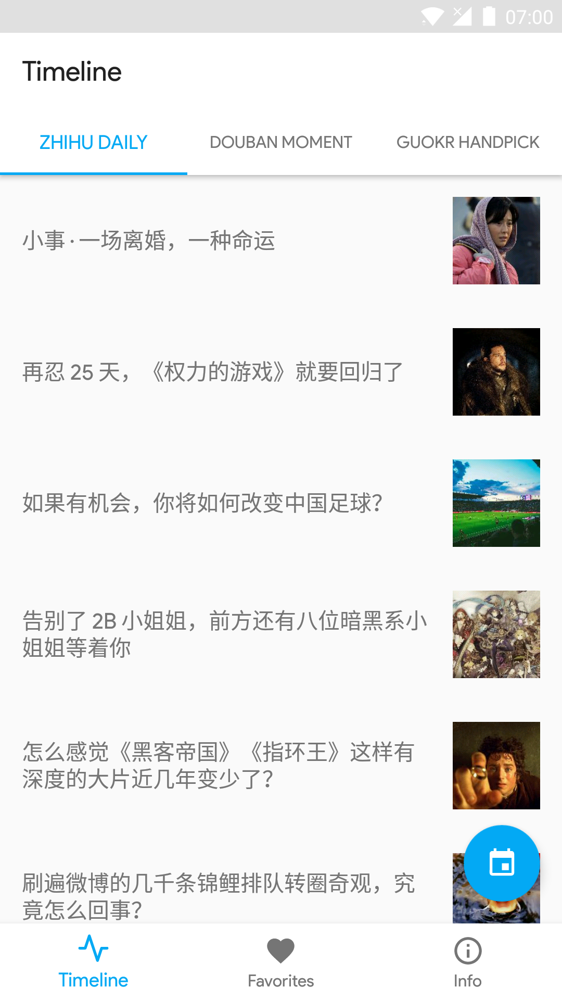
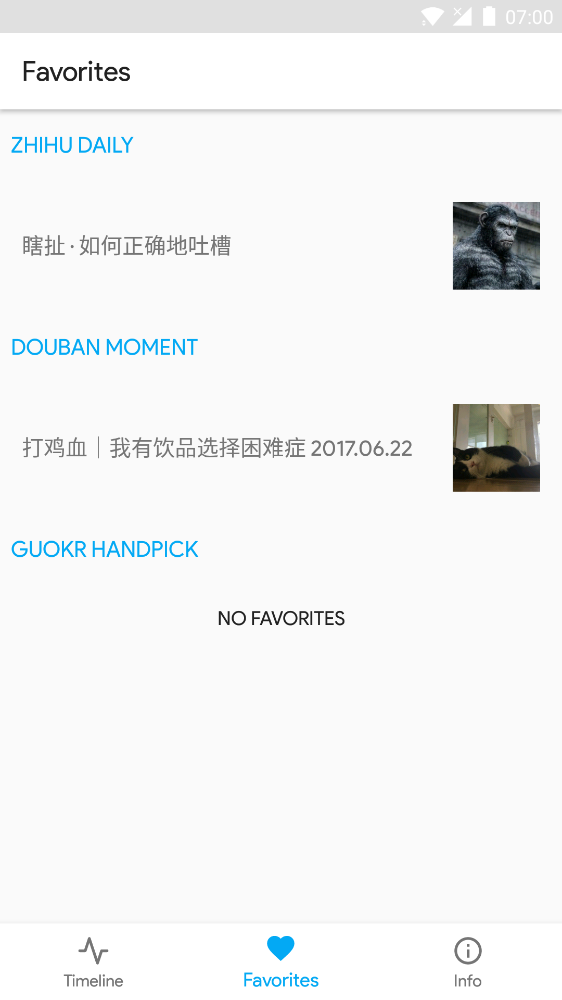
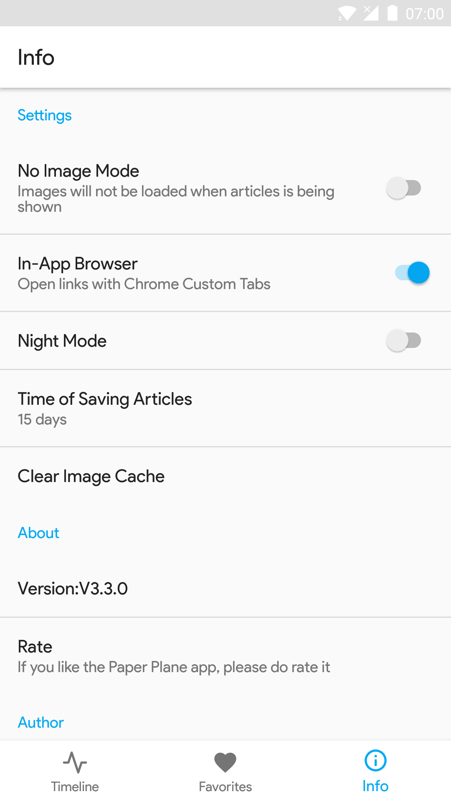
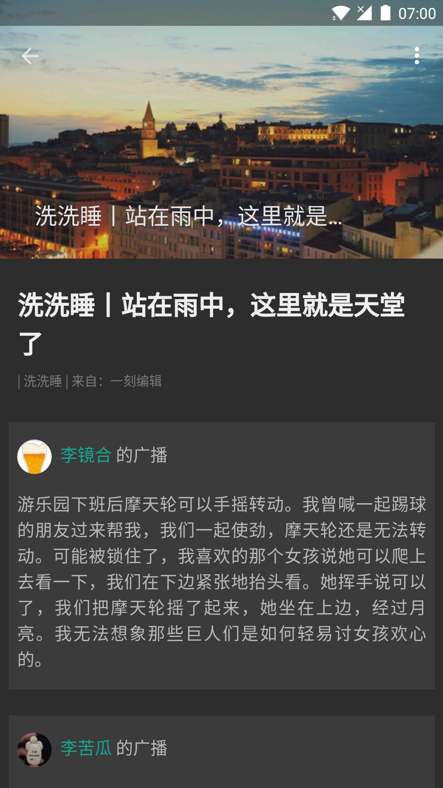

# Paper Plane

[](https://travis-ci.org/TonnyL/PaperPlane)

<div align="center">
	
</div>

Paper Plane is an Android reading app containing articles from [Zhihu Daily](https://daily.zhihu.com/), [Guokr Handpick](http://www.guokr.com/mobile/) and [Douban Moment](https://moment.douban.com/app/). The project is built on [MVP architecture](https://github.com/googlesamples/android-architecture/tree/todo-mvp/) and designed with [Material Design](https://material.io/) style.

## Screenshots
| Timeline    | Favorites    | Info | Details |
| :-------------: | :-------------: |:-------------: | :-------------: |
|  |  |  |  |

## Build
To open this project in Android Studio, begin by checking out of the branches, and then open the `PaperPlane/` dictionary in Android Studio. The following series of steps illustrate how to open the `PaperPlane` branch.

Clone the repository:

```
git clone https://github.com/TonnyL/PaperPlane.git
```

Open the `PaperPlane/` directory in Android Studio.

## Google Play
[](https://play.google.com/store/apps/details?id=com.marktony.zhihudaily)

## Libraries
| Library     | Intro     |
| :------------- | :------------- |
| [Android Support Libraries](https://developer.android.com/topic/libraries/support-library/index.html) | The Android Support Library offers a number of features that are not built into the framework. These libraries offer backward-compatible versions of new features, provide useful UI elements that are not included in the framework, and provide a range of utilities that apps can draw on. |
| [Coroutines](https://github.com/Kotlin/kotlinx.coroutines) | Library support for Kotlin coroutines |
| [Glide](https://github.com/bumptech/glide) | An image loading and caching library for Android focused on smooth scrolling. |
| [Gson](https://github.com/google/gson) | A Java serialization/deserialization library that can convert Java Objects into JSON and back. |
| [Kotlin](https://github.com/JetBrains/kotlin) | The Kotlin Programming Language |
| [MaterialDateTimePicker](https://github.com/wdullaer/MaterialDateTimePicker) | Pick a date or time on Android in style. |
| [Retrofit](https://github.com/square/retrofit) | Type-safe HTTP client for Android and Java by Square, Inc. |
| [Room](https://developer.android.com/topic/libraries/architecture/room.html) | Room provides an abstraction layer over SQLite to allow fluent database access while harnessing the full power of SQLite. |

## Contributions
`Paper Plane` is a fully open sourced project. If you find a bug or want new features, do not hesitate to open an issue or create a pull request. Read the [CONTRIBUTION_GUIDELINES](CONTRIBUTION_GUIDELINES.md) for more detailed information.

There is an entry in the app for the [GitHub Contributors page](https://github.com/TonnyL/PaperPlane/graphs/contributors).

## Thanks to
[wbinarytree](https://github.com/wbinarytree)

## License
PaperPlane is under an Apache2.0 license. See the [LICENSE](LICENSE) for more info.
